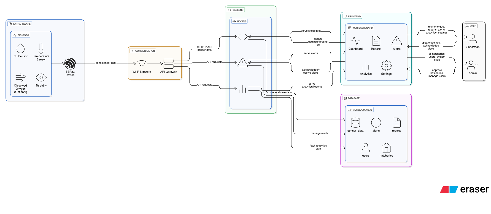

# 🌊 Aqua Mate – Your Hatchery’s Digital Guardian

### Contributors
- **Sumaiya Taslim Tisha** – 0822310205101025  
- **Md. Fardin Faraz** – 0822310105101032  
- **Sahrin Sultana** – 0822310205101037  
- **Hasnayen Jawad** – 0822310105101011  

## 🐟 Project Overview

**Aqua Mate** is an IoT-based smart monitoring system designed to help fishermen and hatchery owners manage their fish ponds with precision and ease.  
Using an **ESP32** microcontroller with sensors (pH, temperature, DO), it continuously collects water quality data and sends it to a **cloud-connected web dashboard**.  
Fishermen can view real-time readings, receive alerts, and take timely action — ensuring healthier fish and higher productivity.

---

## 🎯 Objectives

- Build an IoT device to measure essential hatchery parameters (pH, temperature, DO).
- Send live readings to a cloud database through Node.js API.
- Develop a user-friendly dashboard for real-time & historical data.
- Generate alerts and email notifications for unsafe water conditions.
- Allow multi-hatchery management with secure device–user linking.
- Support data-driven aquaculture practices.

---

## 🧠 System Architecture

*Figure: System architecture showing ESP32 device, sensors, cloud backend, and user dashboard integration.*

---

## 🧩 Technology Stack

| Layer | Technology |
|-------|-------------|
| **Microcontroller** | ESP32 |
| **Sensors** | pH, Temperature (multi-depth), Dissolved Oxygen |
| **Communication** | Wi-Fi (HTTP POST) |
| **Backend** | Node.js + Express.js |
| **Database** | MongoDB Atlas |
| **Frontend** | HTML, CSS, JavaScript, Tailwind, Chart.js |
| **Email Alerts** | Nodemailer |
| **Hosting** | Render / Vercel |

---

## 📊 Key Features (MVP)

- Multi-depth temperature tracking  
- pH and DO monitoring  
- Real-time smart alerts  
- Device registration (QR/ID based)  
- Data visualization dashboard  
- Email notifications  
- Secure user login  
- Cloud-based access  

---

## 📅 Development Roadmap (11 Weeks)

| Week | Milestone |
|------|------------|
| 1 | Setup project, finalize components |
| 2 | Test pH & temperature sensors |
| 3 | Calibrate sensors |
| 4 | Connect ESP32 to Wi-Fi & send test data |
| 5 | Develop Node.js backend |
| 6 | Setup API endpoints |
| 7 | Design dashboard with Chart.js |
| 8 | Implement authentication & device linking |
| 9 | Add alert/email notification |
| 10 | Integrate system (ESP32 → API → DB → Dashboard) |
| 11 | Final testing & documentation |

---

## 🌍 Why Aqua Mate?

Bangladeshi fish farmers often face heavy losses due to poor water monitoring.  
**Aqua Mate** offers a low-cost, IoT-powered solution — enabling scientific, data-driven management of hatcheries for better fish health and sustainability.

---

## 🧾 Conclusion

Aqua Mate is more than an academic project — it’s a **real-world solution** for aquaculture in Bangladesh.  
It combines IoT, data visualization, and smart automation to help fishermen monitor and manage their hatcheries effectively.

---

### 📬 Contact
For questions or collaboration:
**Md. Fardin Faraz**  
[GitHub]https://github.com/Big-Smokkee | [Email]fardinfaraz3579@gmail.com

